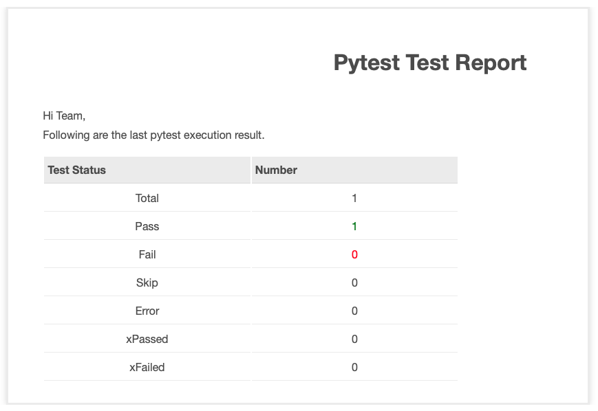

# pytest-send-email

Pytest发送Email邮件插件

---

### 特性

- SMTP服务器及用户密码信息支持写到环境变量或pytest.ini中，也可以命令行参数传入
- 支持选择使用SMTP或SMTP_SSL，支持自定义SMTP端口
- 支持在pytest.ini或命令行参数中定制邮件主题，邮件正文，邮件正文HTML模板
- 支持添加多个附件，文件路径以逗号隔开
- 支持多个收件人，文件路径以逗号隔开

---

### 如何使用

1. 安装 `pytest-send-email`

使用pip安装
```sh
pip pytest-send-email
```

2. 使用方法
在环境变量中添加SMTP_HOST, SMTP_USER,SMTP_PWD并source
```sh
export SMTP_HOST=<smtp-server>
export SMTP_USER=<your-email-user>
export SMTP_PWD=<your-password or token>
```

使用以下参数运行pytest
```sh
pytest --send-email --email-receivers=abc@gmail.com,abc@hotmail.com
```

> 也可以将参数配置到pytest.ini中
```ini
[pytest]
addopts = --send-email --html=report.html

smtp_host = <smtp-server>
smtp_port = <smtp-port>
smtp_user = <your-email-user>
smtp_pwd = <your-password or token>
smtp_ssl = False


email_receivers = superhin@126.com
email_subject = Pytest Test Report
email_body = 
    Hi, this is the test report
email_attachments=test_a.py,report.html

```
或在配置在pytest.ini`[email]`段中
```ini
[pytest] 
addopts = --send-email --html=report.html

[email]
host = <smtp-server>
port = <smtp-port>
user = <your-email-user>
password = <your-password or token>
ssl = False

receivers = superhin@126.com
subject = Pytest Test Report
body = 
    Hi, this is the test report
attachments=test_a.py,report.html
```

然后运行pytest命令即可

3. 支持的命令行参数

- --send-email: 是否发送邮件
- --email-receivers: 邮件收件人，逗号分隔
- --smtp-host: SMTP服务器地址
- --smtp-port: SMTP端口号
- --smtp-user: 邮箱用户
- --smtp-pwd: 邮箱密码
- --smtp-ssl: 是否使用SMTP_SSL
- --email-subject: 邮件主题
- --email-body: 邮件内容，支持HTML
- --email-template: 邮件模板文件路径
- --email-attachments: 邮件附件，逗号分隔

4. 支持的pytest.ini选项

- --smtp_host: SMTP服务器地址
- --smtp_port: SMTP端口号
- --smtp_user: 邮箱用户
- --smtp_pwd: 邮箱密码
- --smtp_ssl: 是否使用SMTP_SSL
- --email_subject: 邮件主题
- --email_body: 邮件内容，支持HTML
- --email_receivers: Email receivers, comma-separated
- --email_template: 邮件模板文件路径
- --email_attachments: 邮件附件，逗号分隔

> 如果你想发邮件，最少要配置--send-email和--email-receivers或email_receivers
---

*报告示例*



---

### 报告信息

- Total: 用例总数
- Passed：成功用例总数
- Failed：失败用例总数
- Skipped：跳过用例总数
- Error：出错用例总数
- XPassed：非期望成功用例总数
- XFailed：期望失败总数

### Todo
- 增加执行时间，时长，用例失败信息，日志，图表等更多的信息
- 支持JinJa2渲染模板
- 支持对用例标记失败时发邮件给谁

---

- Email: <a href="mailto:superhin@126.com?Subject=Pytest%20Email" target="_blank">`superhin@126.com`</a> 
- Blog: <a href="https://www.cnblogs.com/superhin/" target="_blank">`博客园 韩志超`</a>
- 简书: <a href="https://www.jianshu.com/u/0115903ded22" target="_blank">`简书 韩志超`</a>

